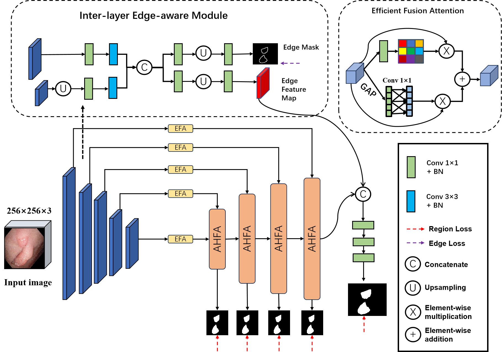
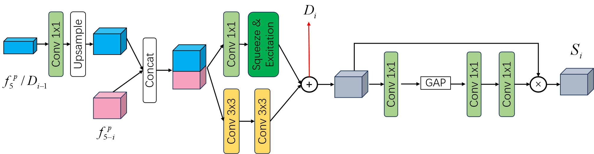
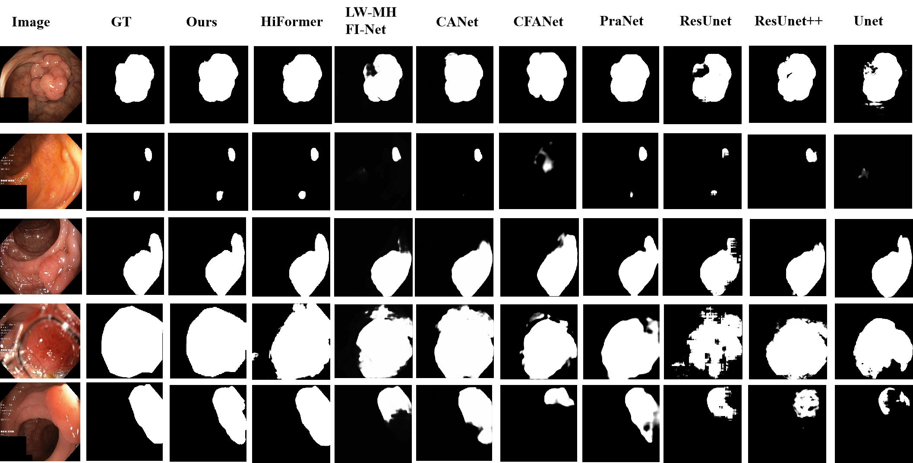
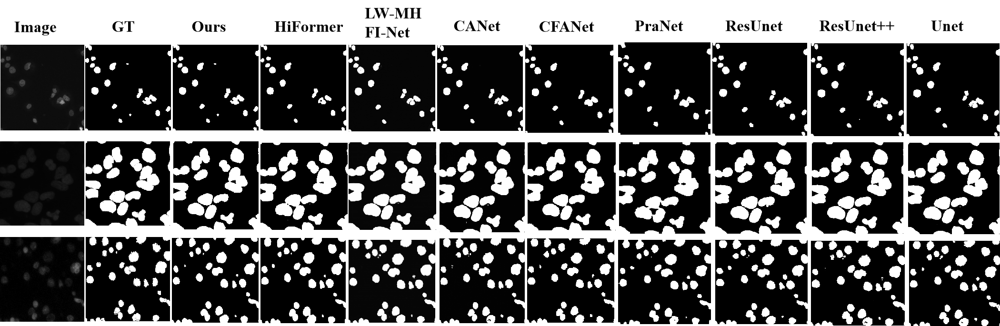
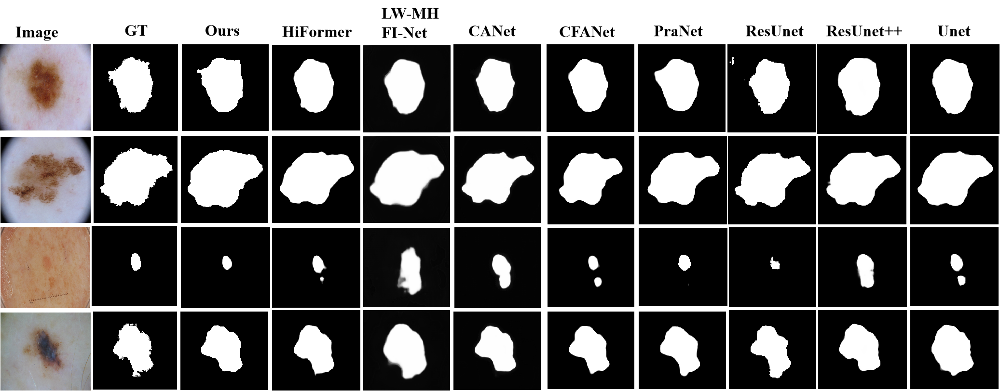
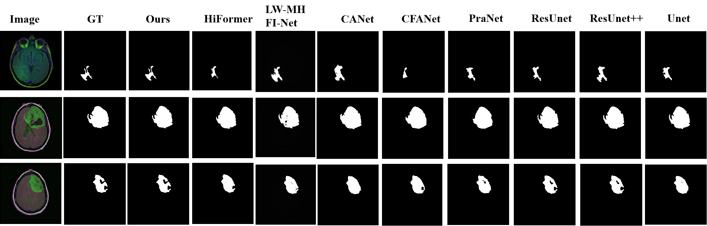
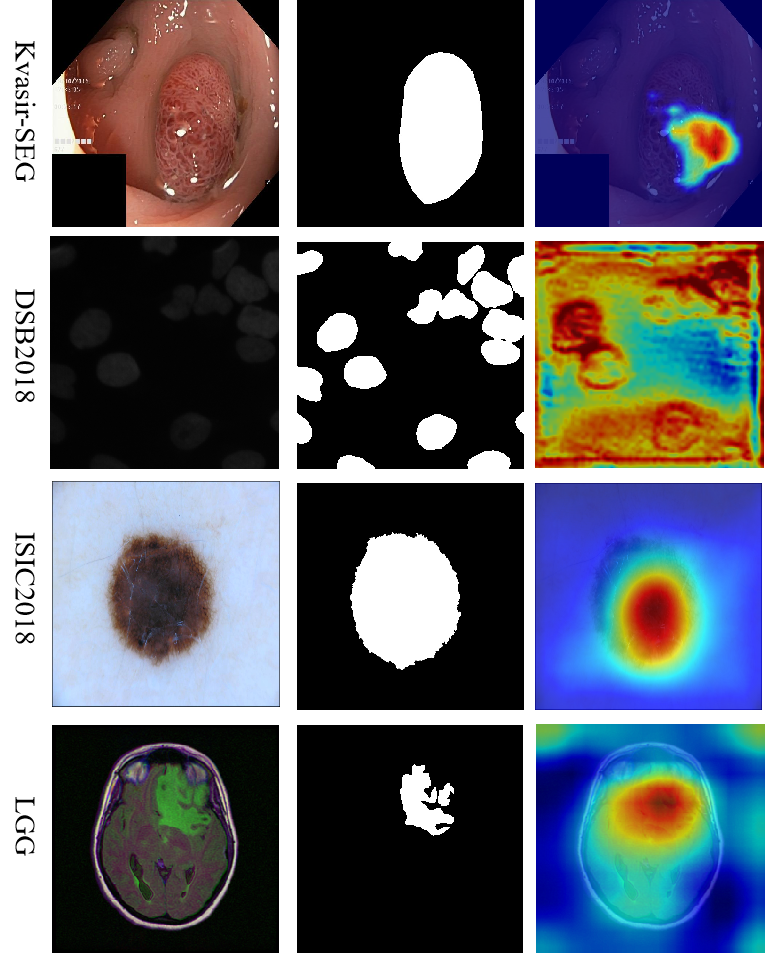

# :rainbow:: EHANet: Edge-guided and Hierarchical Aggregation Network for Robust Medical Image Segmentation

:exclamation: The full code will be released after accpetance.

## States
- 22.10 Submit revised version
- 29.08 Major revision
- 15.07 Underview
- 10.07.2024 - The article was submitted to Journal "Biomedical Signal Processing and Control" for review. 

## Overview
This paper introduces a novel Edge-guided and Hierarchical Aggregation Network (EHANet) which excels at capturing rich contextual information and preserving fine spatial details, addressing the critical issues of inaccurate mask edges and detail loss prevalent in current segmentation models. The Inter-layer Edge-aware Module (IEM) enhances edge prediction accuracy by fusing early encoder layers, ensuring precise edge delineation. The Efficient Fusion Attention Module (EFA) adaptively emphasizes critical spatial and channel features while filtering out redundancies, enhancing the model's perception and representation capabilities. The Adaptive Hierarchical Feature Aggregation Module (AHFA) module optimizes feature fusion within the decoder, maintaining essential information and improving reconstruction fidelity through hierarchical processing. 

### AHFA

## Results on Kvasir-SEG

## Results on DSB 2018

## Results on ISIC 2018

## Results on LGG

## Grad-cam result

## :black_nib: For citation
waiting...

:exclamation: :eyes: **The codes can not be used for commercial purposes!!!**
